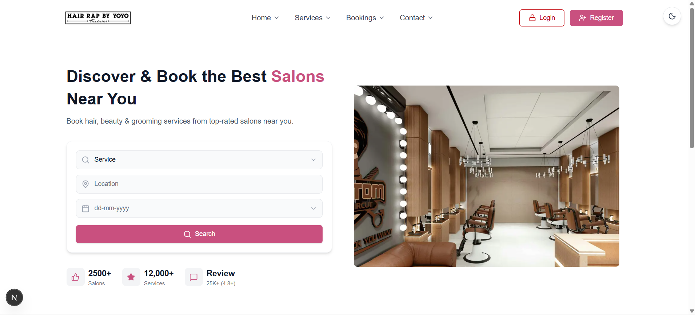
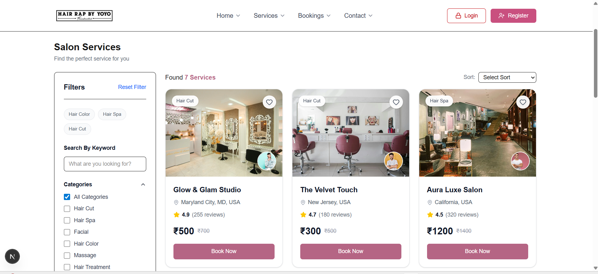
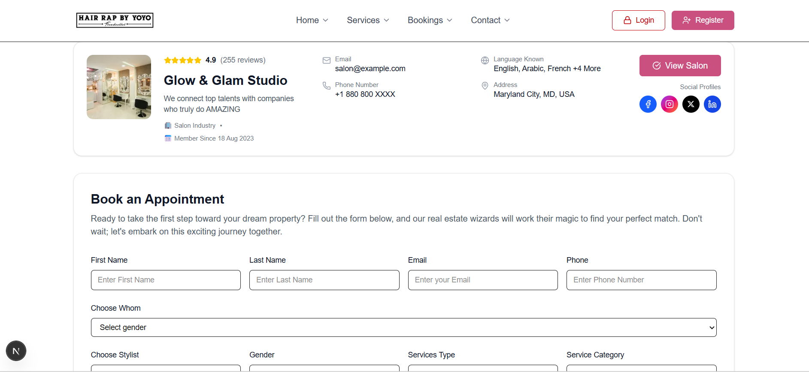
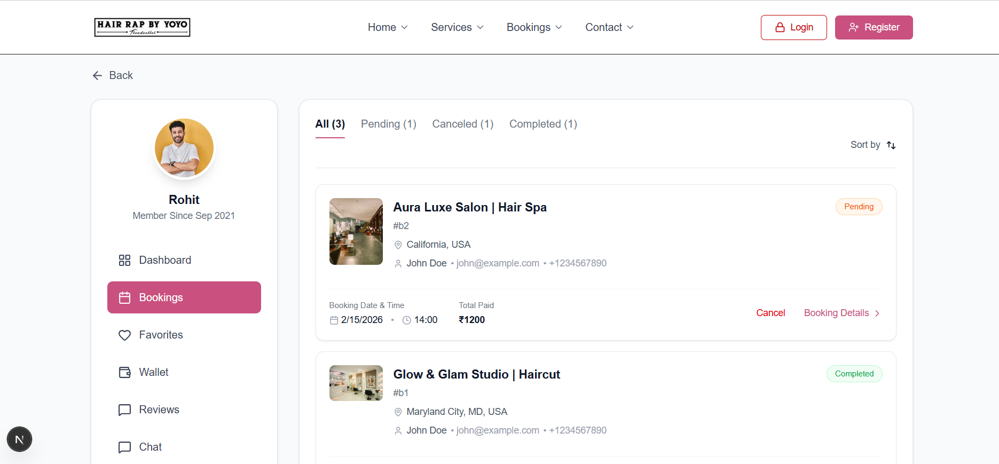
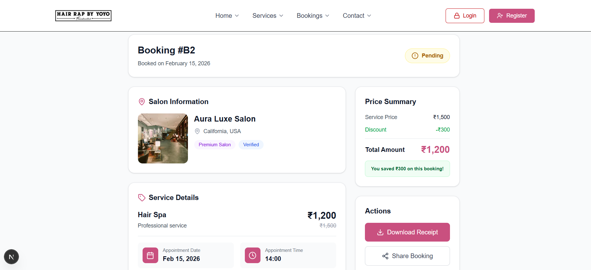
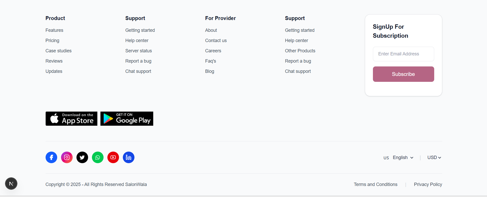

# 💇‍♀️ Salon Booking App

A modern salon booking platform built with Next.js 14, TypeScript, and Tailwind CSS. This application allows users to browse salon services and book appointments with a clean, responsive interface.

[](https://nextjs.org/)
[](https://www.typescriptlang.org/)
[](https://tailwindcss.com/)

---

## 🌟 Features

### 🏠 Home Page
- Hero section with salon image
- Search functionality (Service, Location, Date/Time)
- Statistics display (2500+ Salons, 12,000+ Services, Reviews)
- "Why Choose Us" feature cards
- Fully responsive design

### 💼 Services Page
- Browse all available salon services
- Filter by categories:
  - All Categories
  - Hair Cut and Blow Dry
  - Royal Hair Cut
  - Kids Cut
  - Elegant Hair Wash
  - Root Touch up
  - Hair Color
- Sub-category filter
- Location filter
- Price range slider (₹0 - ₹2000)
- Rating filters (5★, 4★, 3★)
- Search by keyword
- Sort by: Price Low to High / Price High to Low
- Grid/List view toggle
- Service cards display:
  - Salon name and location
  - Ratings and review count
  - Price with discount
  - "Book Now" button

### 📝 Booking Page
- **Salon Header Section**:
  - Salon image
  - 5-star rating display (4.9 with 255 reviews)
  - Salon name (e.g., "Glow & Glam Studio")
  - Email and phone contact
  - Languages known
  - Location address
  - Social media links (Facebook, Instagram, Twitter, LinkedIn)
  - "View Salon" button

- **Booking Form**:
  - **Personal Details**:
    - First Name (required)
    - Last Name (required)
    - Email (required)
    - Phone (required)
  - **Preferences**:
    - Choose Whom (Gender selection)
    - Choose Stylist
    - Gender preference for stylist
    - Service Type dropdown
    - Service Category
  - **Schedule**:
    - Date picker (required)
    - Time picker (required)
  - **Additional**:
    - Message/Notes (optional)
  - **Price Display**:
    - Total amount
    - Original price (strikethrough)
    - Discount badge (30% OFF)
  - "Book Now" button

- Form validation
- Success message: "Booking Done! Your appointment has been confirmed."
- Auto-redirect to bookings page after successful booking

### 📋 My Bookings Page
- **Sidebar Navigation**:
  - User profile section (Name: "John Smith", Member Since Sep 2021)
  - Dashboard
  - Bookings (active)
  - Favorites
  - Wallet
  - Reviews
  - Chat
  - Settings
  - Logout

- **Bookings List**:
  - Tab filters:
    - All (shows count)
    - Pending (shows count)
    - Canceled (shows count)
    - Completed (shows count)
  - Sort by dropdown
  
- **Booking Cards Display**:
  - Checkbox for selection
  - Salon image
  - Salon name and service name (e.g., "Glow & Glam Studio | Hair Cut")
  - Booking ID (e.g., "#R123")
  - Status badge:
    - 🟢 Completed (green)
    - 🟠 Pending (orange)
    - 🔴 Canceled (red)
  - Customer information (name, email, phone)
  - Location
  - Booking date and time
  - Total paid (₹459)
  - Stylist and category (if selected)
  - "Booking Details" link
  - "Cancel" button (for pending bookings only)
  
- Pagination (1, 2, 3 with arrows)

### 🎨 UI Components
- **Navbar**:
  - Logo
  - Navigation links (Home, Services, About Us, Contact)
  - Login button (red border)
  - Register button (pink background)
  - Responsive hamburger menu for mobile
  - Sticky header

- **Footer**:
  - 4 columns: Product, Support, For Provider, Support
  - Newsletter subscription box
  - App Store and Google Play badges
  - Social media icons (Facebook, Instagram, Twitter, WhatsApp, YouTube, LinkedIn)
  - Language selector (English with flag)
  - Currency selector (USD)
  - Copyright text
  - Terms and Privacy Policy links

---

## 🛠️ Tech Stack

- **Framework**: Next.js 14 (App Router)
- **Language**: TypeScript
- **Styling**: Tailwind CSS
- **Icons**: Lucide React, React Icons
- **HTTP Client**: Axios
- **Image Handling**: Next.js Image component

---

## 📂 Project Structure

```
salon-booking-app/
├── app/
│   ├── api/
│   │   ├── bookings/
│   │   │   └── route.ts
│   │   └── services/
│   │       └── route.ts
│   ├── book/
│   │   └── page.tsx
│   ├── bookings/
│   │   └── page.tsx
│   ├── services/
│   │   └── page.tsx
│   ├── layout.tsx
│   ├── page.tsx
│   ├── favicon.ico
│   └── globals.css
├── components/
│   ├── ui/
│   │   ├── Button.tsx
│   │   ├── Input.tsx
│   │   └── Select.tsx
│   ├── BookingForm.tsx
│   ├── BookingItem.tsx
│   ├── Footer.tsx
│   ├── Hero.tsx
│   ├── HomePage.tsx
│   ├── Navbar.tsx
│   ├── ServiceCard.tsx
│   └── ServiceFilters.tsx
├── lib/
│   ├── api.ts
│   └── mockData.ts
├── types/
│   ├── booking.ts
│   └── service.ts
├── public/
│   └── assets/
│       ├── logo.jpg
│       ├── homeImg.jpg
│       ├── s1.jpg - s4.jpg
│       ├── apple.png
│       └── gpay.png
├── tailwind.config.ts
├── tsconfig.json
└── package.json
```

---

## 🚀 Getting Started

### Prerequisites
- Node.js 18 or higher
- npm or yarn

### Installation

1. Clone the repository
```bash
git clone <repository-url>
cd salon-booking-app
```

2. Install dependencies
```bash
npm install
```

3. Run development server
```bash
npm run dev
```

4. Open browser at `http://localhost:3000`

### Build for Production
```bash
npm run build
npm start
```

---

## 📸 Screenshots

### Home Page


---

### Services Page


---

### Booking Form


---

### My Bookings


---

### Booking Details


---

### Footer


---

## 🎯 How It Works

### Booking Flow
1. **Browse Services**: User visits `/services` and browses available salon services
2. **Select Service**: User clicks "Book Now" on a service card
3. **Fill Form**: User is redirected to `/book` with:
   - Salon details pre-populated (name, image, location)
   - Form to enter personal details
   - Select preferences (stylist, date, time)
4. **Submit Booking**: Form validates and creates booking with status "PENDING"
5. **View Bookings**: User is redirected to `/bookings` to see their booking

### Data Storage
- Uses in-memory storage (mock data)
- Bookings are stored in an array
- Data persists during the session but resets on server restart

---

## 📊 Data Models

### Service
```typescript
{
  id: string;
  name: string;
  price: number;
  duration: number;
  salonName?: string;
  salonImage?: string;
  salonLocation?: string;
  salonRating?: number;
  salonReviews?: number;
  category?: string;
}
```

### Booking
```typescript
{
  id: string;
  userId: string;
  serviceId: string;
  serviceName: string;
  salonName?: string;
  salonImage?: string;
  salonLocation?: string;
  firstName?: string;
  lastName?: string;
  email?: string;
  phone?: string;
  gender?: string;
  stylist?: string;
  preferredGender?: string;
  serviceCategory?: string;
  date: string;
  time: string;
  note?: string;
  status: "PENDING" | "CONFIRMED" | "CANCELLED";
  price?: number;
  originalPrice?: number;
  discount?: number;
  createdAt?: string;
}
```

---

## 🎨 Design System

### Colors
- **Primary Brand**: `#C9507F` (Pink)
- **Success**: Green (Confirmed status)
- **Warning**: Orange (Pending status)
- **Error**: Red (Cancelled status, Login button)

### Key Styles
- Rounded corners: `rounded-lg`, `rounded-xl`, `rounded-2xl`
- Shadows: `shadow-sm`, `shadow-lg`
- Transitions: `transition-colors`, `transition-shadow`

---

## 🚦 API Routes

### GET /api/services
Returns list of all services
```json
{
  "success": true,
  "data": [...]
}
```

### GET /api/bookings
Returns list of all bookings
```json
{
  "success": true,
  "data": [...]
}
```

### POST /api/bookings
Creates a new booking
```json
{
  "success": true,
  "message": "Booking created successfully",
  "data": {...}
}
```

### PATCH /api/bookings
Cancels a booking (changes status to "CANCELLED")
```json
{
  "success": true,
  "message": "Booking cancelled",
  "data": {...}
}
```

---

## 📱 Responsive Design

- **Mobile**: Hamburger menu, stacked layouts
- **Tablet**: 2-column grids
- **Desktop**: Full 3-column service grid, sidebar navigation

---

## 🔧 Configuration

### Tailwind Custom Colors
```javascript
// tailwind.config.ts
theme: {
  extend: {
    colors: {
      brand: '#C9507F'
    }
  }
}
```

---

## 📝 Sample Data

### Services (8 total)
1. Haircut - ₹500 (30 mins)
2. Beard Trim - ₹300 (20 mins)
3. Hair Spa - ₹1200 (60 mins)
4. Facial - ₹900 (45 mins)
5. Hair Color - ₹1500 (90 mins)
6. Head Massage - ₹400 (20 mins)
7. Keratin Treatment - ₹2500 (120 mins)
8. Manicure & Pedicure - ₹700 (50 mins)

### Sample Bookings (3 pre-loaded)
- Haircut (Confirmed)
- Hair Spa (Pending)
- Beard Trim (Cancelled)

---

## 👨‍💻 Development

Built as a learning project to demonstrate:
- Next.js 14 App Router
- TypeScript type safety
- Tailwind CSS styling
- Component-based architecture
- Form handling and validation
- API routes
- Responsive design

---

## 📄 License

This project is open source and available under the MIT License.

---

<div align="center">
  <p>Built with Next.js, TypeScript, and Tailwind CSS</p>
  <p>© 2026 Salon Booking App</p>
</div>